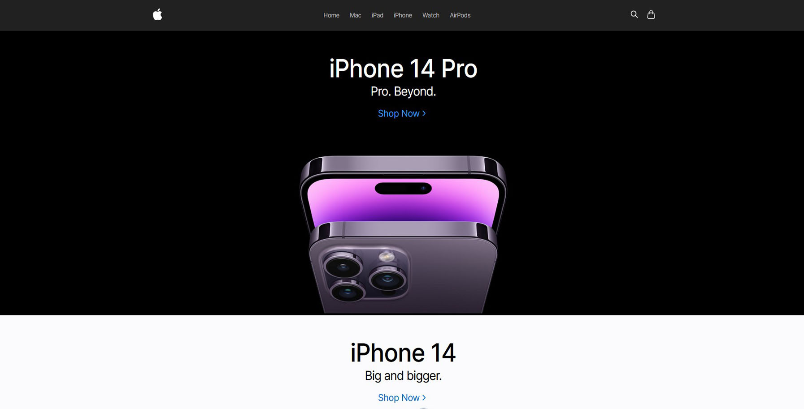

# Apple E-Commerce Store



Modern Apple store created with React, TypeScript, Stripe payments and Strapi backend for data stored. Styling with SASS.

https://apple-store-sd.vercel.app

## Main technologies


## Stack

- [Strapi](https://strapi.io) - the next-gen headless CMS, open-source, javascript, enabling content-rich experiences to be created, managed and exposed to any digital device
- [Stripe](https://stripe.com) - a suite of APIs powering online payment processing and commerce solutions for internet businesses of all sizes
- [Axios](https://axios-http.com) - a simple promise based HTTP client for the browser and node.js
- [React Icons](https://react-icons.github.io/react-icons) - popular icons in your React projects which utilizes ES6 imports that allows you to include only the icons that your project is using.
- [React Router](https://reactrouter.com/en/main) - a standard library for routing in React
- [React Query](https://tanstack.com/query/v4) - powerful asynchronous state management for TS/JS, React, Solid, Vue and Svelte
- [Vite](https://vitejs.dev) - a new breed of frontend build tooling that significantly improves the frontend development experience

## Details

- client created with React (Vite) with TypeScript
- payments provided by Stripe
- CMS with Strapi
- server deploy on Railway.app with PostgreSQL
- locale data stored on SQLite
- media stored on Cloudinary
- env variables used to switch between locale and production
- data fetching and caching with Tanstack React Query
- axios and REST API used to fetch data
- context and reducer used for manage cart items
- routing with React Router v6.6
- layout and styling with SASS
- responsive website design
- inspired by Apple

## Tutorial and project structure

Inside of project, you'll see the following folders and files:

```
PROJECT_ROOT
├── client                      # client files
│   ├── public                  # static assets
│   └── src
│       ├── assets              # images and files
│       ├── components          # React components
│       ├── lib
│       │    ├── api            # fetching functions
│       │    ├── config         # SASS responsive config
│       │    ├── context        # React context and reducer files
│       │    ├── hooks          # custom hooks
│       │    └── interfaces     # TypeScript interfaces
│       └── pages               # page files
│
└── server                      # server files
```

Go to `client` and `server` directory and download all missing dependencies with:

```
npm install (client) / yarn install (server, yarn required)
```

After that you can run this project using:

```
npm run dev (client) / yarn develop (server)
```

**To deploy and manage server content you need to create Railway (for server with database, free hosting for 20 days), Cloudinary (for media) and Stripe (for payments) accounts.**

After that, just create the `.env` file with the following data in `server` directory and restart your application:

```
ADMIN_JWT_SECRET = GENERATE_RANDOM_CODE
API_TOKEN_SALT = GENERATE_RANDOM_CODE
APP_KEYS = GENERATE_RANDOM_CODE
JWT_SECRET = GENERATE_RANDOM_CODE
CLOUDINARY_KEY = YOUR_CLOUDINARY_KEY
CLOUDINARY_NAME = YOUR_CLOUDINARY_NAME
CLOUDINARY_SECRET = YOUR_CLOUDINARY_SECRET
STRIPE_KEY = YOUR_STRIPE_KEY
CLIENT_URL = YOUR_CLIENT_URL
NODE_ENV = development (for development) / production (for production)
```

Except that you have to create `.env` file for `client` directory with following data:

```
VITE_STRAPI_USER_TOKEN = YOUT_STRAPI_TOKEN_FOR_READING_DATA (created on strapi)
VITE_STRIPE_PUBLISHABLE_KEY = YOUR_STRAPI_PUBLISHABLE_KEY
VITE_STRAPI_SERVER_URL = YOUR_STRAPI_SERVER_URL
```

**Don't forget to add the enviroment variables to your deployment services!**
